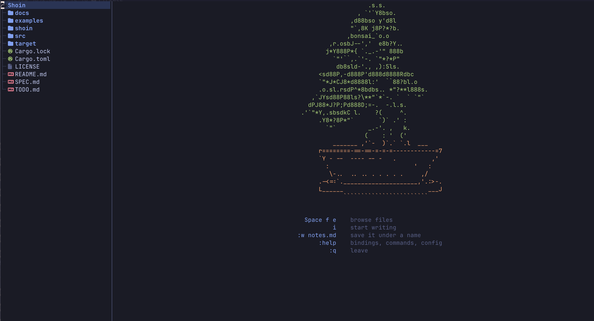

# Pictures in a document

An image is embedded the same way a note is — with `![[…]]`. What changes is
what the embed expands into: not the target's text, but a box the shape of the
picture.

![[shoin.png]]

Above this line is the whole feature. In a terminal that can draw pixels the
picture is really there; in one that cannot, the box and its caption *are* the
picture, and the document keeps its shape either way.

## The link forms

An embed resolves by the ordinary rules, so the extension is optional. Both of
these name the same file:

![[shoin]]

A bare `![[shoin]]` would prefer `shoin.md` if a note by that name sat beside
the picture, because a note is the file you can edit. There is no `shoin.md`
here, so the picture wins.

## When it isn't there

A link that resolves to nothing leaves something visible rather than a silent
hole — the same promise embeds make for notes:

![[no-such-picture.png]]

## Not the same thing

Markdown's own image syntax stays text on screen. It is a *reference* to a
picture, and it is what `:export` writes out:

The difference is worth keeping. `![[…]]` says "put the picture here, I am
composing with it"; `` says "the picture lives at this path".

## Where the cursor is

Put the cursor on the `![[shoin.png]]` line above and the raw link comes back,
exactly as `**bold**` does on the line you are editing. That is not a special
case for images — it is SPEC §2, the same rule the whole editor is built on,
and it is why an embedded picture can never be edited by accident: the cursor
is never inside one.
