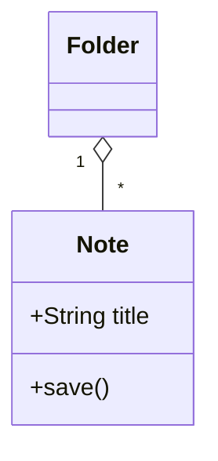
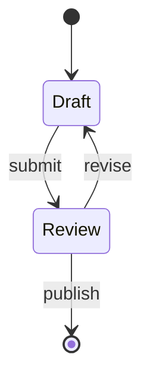
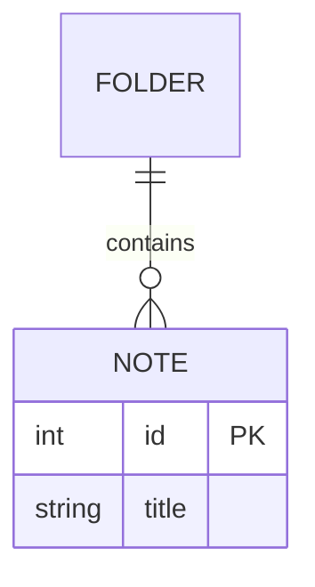
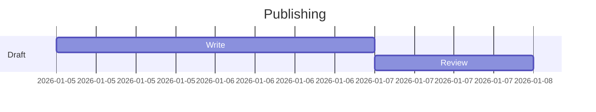
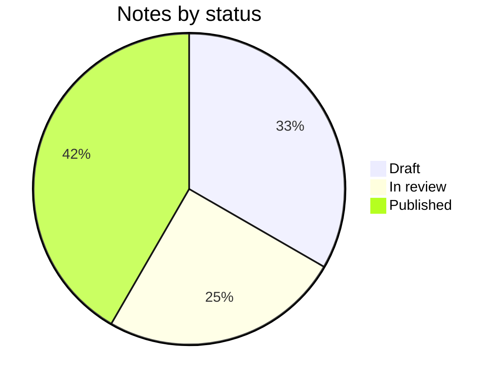

# Mermaid diagram families

## Class

```mermaid
classDiagram
    class Note {
        +String title
        +save()
    }
    class Folder
    Folder "1" o-- "*" Note
```

## State

```mermaid
stateDiagram-v2
    [*] --> Draft
    Draft --> Review: submit
    Review --> Draft: revise
    Review --> [*]: publish
```

## Entity relationship

```mermaid
erDiagram
    FOLDER ||--o{ NOTE : contains
    NOTE {
        int id PK
        string title
    }
```

## Gantt

```mermaid
gantt
    title Publishing
    dateFormat YYYY-MM-DD
    section Draft
    Write  :write, 2026-01-05, 2d
    Review :after write, 1d
```

## Pie

```mermaid
pie title Notes by status
    "Draft" : 4
    "In review" : 3
    "Published" : 5
```
