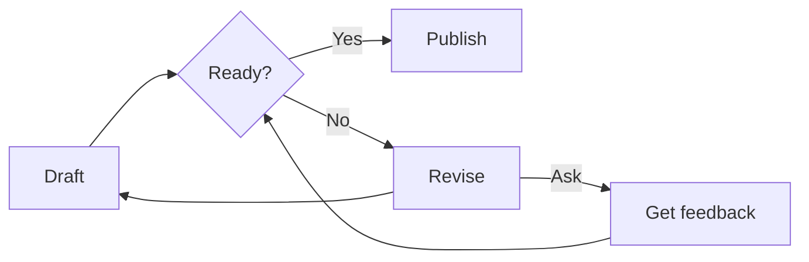
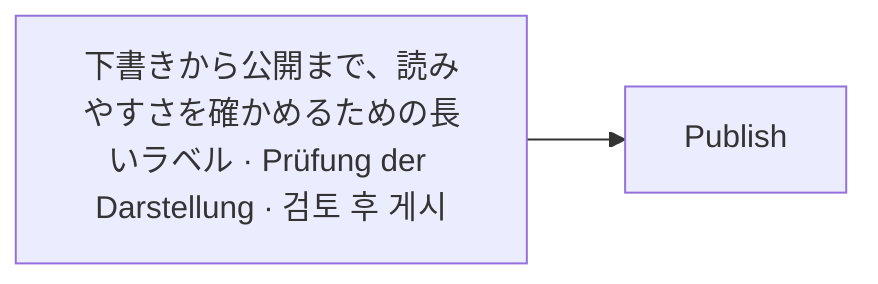
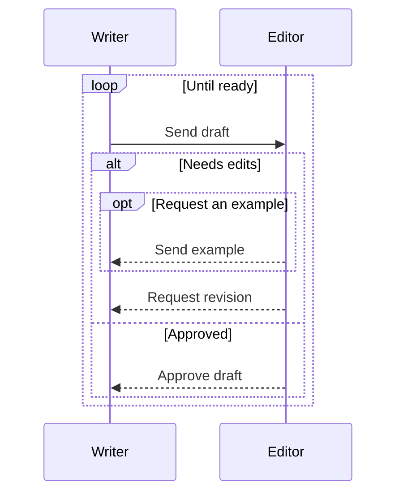

# Mermaid stress cases

## Cyclic branch

```mermaid
flowchart LR
    A[Draft] --> B{Ready?}
    B -->|Yes| C[Publish]
    B -->|No| D[Revise]
    D --> A
    D -->|Ask| E[Get feedback]
    E --> B
```

## Long Unicode label

```mermaid
flowchart LR
    A["下書きから公開まで、読みやすさを確かめるための長いラベル · Prüfung der Darstellung · 검토 후 게시"] --> B[Publish]
```

## Nested sequence frames

```mermaid
sequenceDiagram
    participant W as Writer
    participant E as Editor
    loop Until ready
        W->>E: Send draft
        alt Needs edits
            opt Request an example
                E-->>W: Send example
            end
            E-->>W: Request revision
        else Approved
            E-->>W: Approve draft
        end
    end
```
